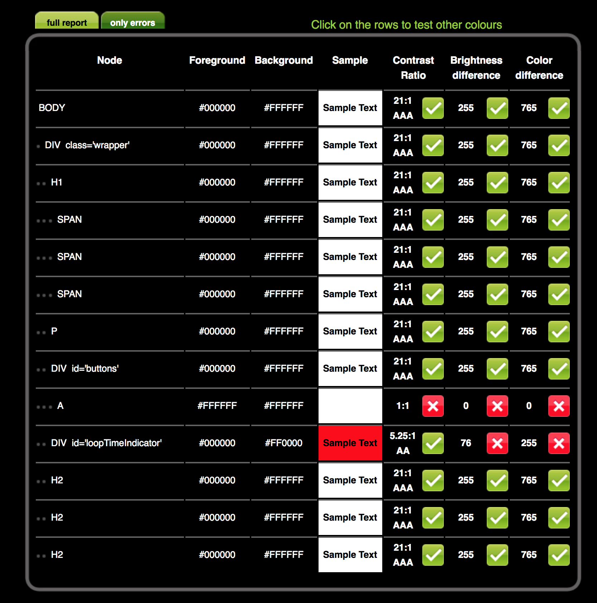
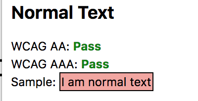
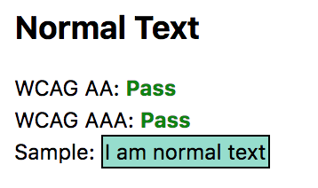
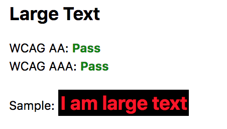
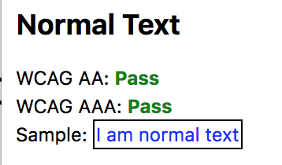
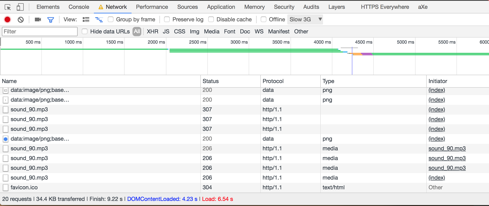
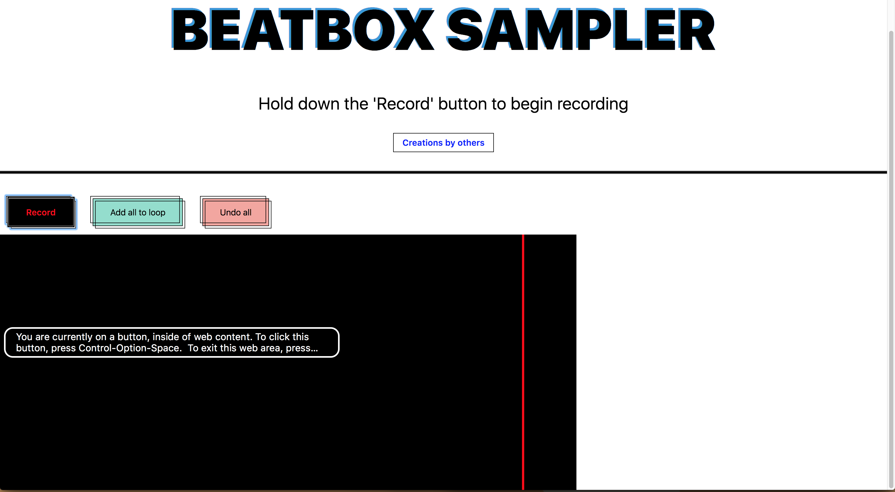

# BEATBOX SAMPLER
Dit is een demo gebaseerd op audio samplers.
Je kunt een geluid opnemen en deze herhaald af laten spelen.
Je kunt ook kiezen wanneer de geluiden worden afgespeeld.

## Core
Core functionaliteit is het afspelen van geluid. (IE9)

## Acceptable
In nieuwe browsers is het mogelijk om geluiden op te nemen en deze herhaald af te spelen.

## Enjoyable
De geluiden worden gevisualiseerd.

## Browser compatibility
De demo gebruikt vrij nieuwe technieken om plezierig te zijn.
Hieronder geef ik per techniek aan welke (populaire) browser, en versie, dit ondersteunt

- `window.matchMedia`
	- IE10
	- Edge
	- Safari 5.1
	- Chrome 9
	- Firefox 6
	- Opera 12.1
- `Array.prototype.forEach`
	- IE9 (When not in 'strict mode')
	- Edge
	- Safari 6
	- Firefox 21
	- Chrome 23
	- Opera 15
- `document.querySelector`
	- IE9
	- Edge
	- Safari 3.1
	- Firefox 3.5
	- Chrome 4
	- Opera 10.1
- `window.AudioContext || window.webkitAudioContext`
	- IE *Geen Support*
	- Edge 12
	- Safari 6 (With _webkit_ prefix)
	- Firefox 25
	- Chrome 34
	- Opera 22
- `navigator.mediaDevices.getUserMedia`
	- IE *Geen Support*
	- Edge 12
	- Safari 11
	- Firefox 42
	- Chrome 53
	- Opera 40
- `new MediaRecorder`
	- IE *Geen Support*
	- Edge *Geen Support*
	- Safari *Geen Support*
	- Firefox 29
	- Chrome 49
	- Opera 36

## Onderzoek browsers en devices

### Samsung:

Werkt op Chrome.

### Windows tablet:

Werkt niet op Edge (Fallback)

### IE 10:

Fallback IE10 (Fallback)

## Accessibility
De website moet met een toetsenbord te gebruiken zijn.

De record button gebruikt `onmousedown` om de button te activeren.
Daarom heb ik een `keyCode`listener toegevoegd zodat de knop alsnog te gebruiken is. 

 ## Afbeeldingen
 Applicatie gebruikt geen afbeeldingen.
 Alles wordt gegenereerd met CSS en JavaScript.

 ## Custom fonts
 
 Ik gebruik de fonts die per platform de standaard zijn.
 [Resource](https://css-tricks.com/snippets/css/system-font-stack/)
 
 ## Javascript

In de JavaScript zit de meeste functionaliteit. 
Voor dit project gebruik ik [`navigator.mediaDevices.getUserMedia`](https://developer.mozilla.org/en-US/docs/Web/API/Navigator/getUserMedia) voor microfoon functionaliteiten en [`MediaRecorder`](https://developer.mozilla.org/en-US/docs/Web/API/MediaRecorder) voor het recorden van media. Dit zijn wat nieuwere technieken waar alleen moderne browsers support voor leveren.

Als fallback laat ik `<audio>` elementen zien van tracks die andere gebruikers gemaakt hebben.

 ## Kleur
 Alle kleuren hebben een hoog contrast
 
 
 
 
 
 
 ## Breedband internet

Eenmaal geladen gebruikt de website geen internet verbinding meer tenzij je audio bestanden van anderen wilt beluisteren of downloaden. Dit wordt via de browser allemaal afgehandeld. 
De website bevat bijna niets, enkel een geringe hoeveelheid JavaScript, de laadtijd is daarom ook niet hoog op bijv. Slow 3g(±4 sec).
 

 ## Cookies
 
 De site heeft geen cookies nodig om normaal te functioneren, dus dit is niet van toepassing.
 
 ## Testen met een screenreader
  
  
Met VoiceOver op de Mac heb ik een screenreader kunnen simuleren, de website is volledig door te tabben en de screenreader kon ook alles wat belangrijk was voorlezen.

## Local Storage

N.v.t.
 
## Muis/Trackpad

Het interface is volledig bruikbaar met muis, trackpad of toetsenbord.